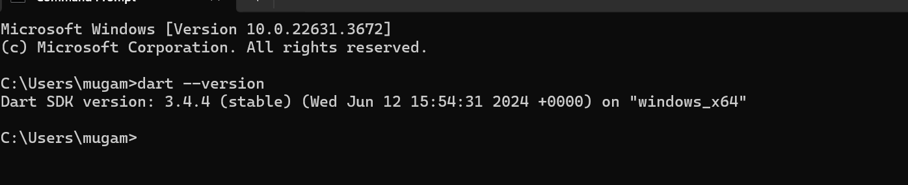
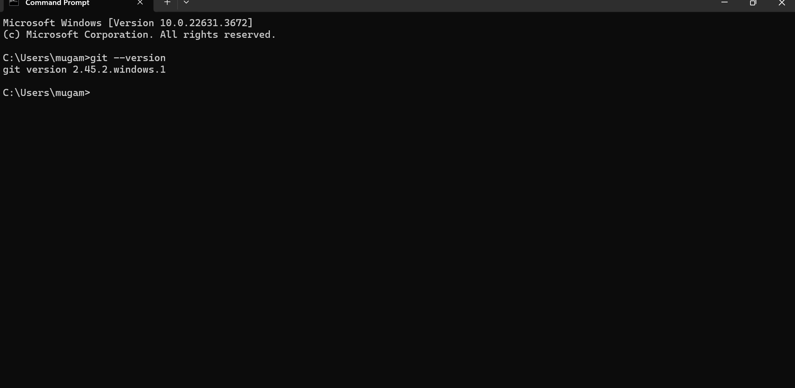
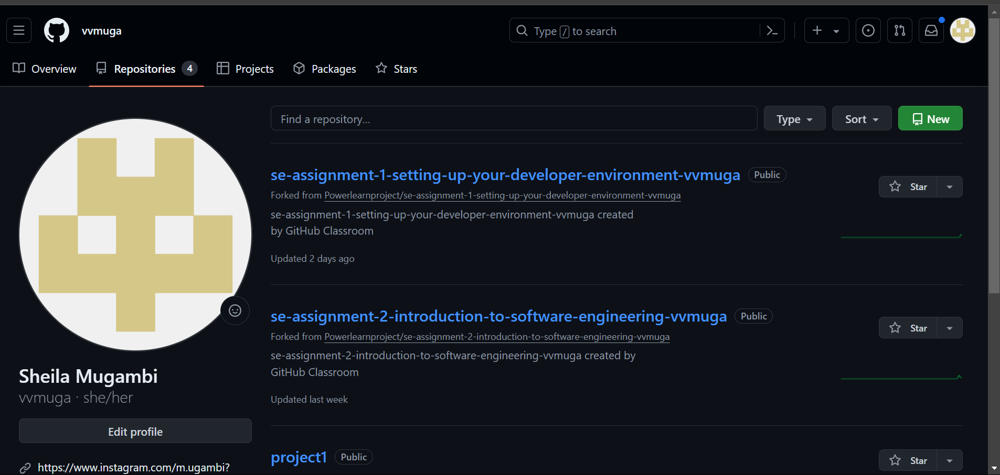
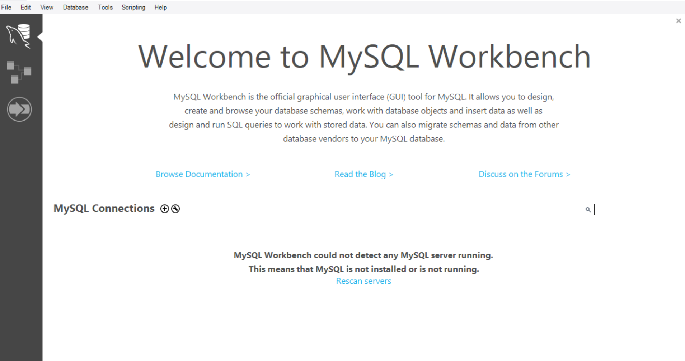
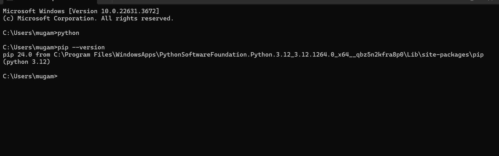

[](https://classroom.github.com/a/vbnbTt5m)
[](https://classroom.github.com/online_ide?assignment_repo_id=15285869&assignment_repo_type=AssignmentRepo)
# Dev_Setup
Setup Development Environment

#Assignment: Setting Up Your Developer Environment

#Objective:
This assignment aims to familiarize you with the tools and configurations necessary to set up an efficient developer environment for software engineering projects. Completing this assignment will give you the skills required to set up a robust and productive workspace conducive to coding, debugging, version control, and collaboration.

#Tasks:

1. Select Your Operating System (OS):
   Choose an operating system that best suits your preferences and project requirements. Download and Install Windows 11. https://www.microsoft.com/software-download/windows11

2. Install a Text Editor or Integrated Development Environment (IDE):
   Select and install a text editor or IDE suitable for your programming languages and workflow. Download and Install Visual Studio Code. https://code.visualstudio.com/Download
3. Set Up Version Control System:
   Install Git and configure it on your local machine. Create a GitHub account for hosting your repositories. Initialize a Git repository for your project and make your first commit. https://github.com

4. Install Necessary Programming Languages and Runtimes:
  Instal Python from http://wwww.python.org programming language required for your project and install their respective compilers, interpreters, or runtimes. Ensure you have the necessary tools to build and execute your code.

5. Install Package Managers:
   If applicable, install package managers like pip (Python).

6. Configure a Database (MySQL):
   Download and install MySQL database. https://dev.mysql.com/downloads/windows/installer/5.7.html

7. Set Up Development Environments and Virtualization (Optional):
   Consider using virtualization tools like Docker or virtual machines to isolate project dependencies and ensure consistent environments across different machines.

8. Explore Extensions and Plugins:
   Explore available extensions, plugins, and add-ons for your chosen text editor or IDE to enhance functionality, such as syntax highlighting, linting, code formatting, and version control integration.

9. Document Your Setup:
    Create a comprehensive document outlining the steps you've taken to set up your developer environment. Include any configurations, customizations, or troubleshooting steps encountered during the process. 

#Deliverables:
- Document detailing the setup process with step-by-step instructions and screenshots where necessary.
- A GitHub repository containing a sample project initialized with Git and any necessary configuration files (e.g., .gitignore).
- A reflection on the challenges faced during setup and strategies employed to overcome them.

#Submission:
Submit your document and GitHub repository link through the designated platform or email to the instructor by the specified deadline.

#Evaluation Criteria:**
- Completeness and accuracy of setup documentation.
- Effectiveness of version control implementation.
- Appropriateness of tools selected for the project requirements.
- Clarity of reflection on challenges and solutions encountered.
- Adherence to submission guidelines and deadlines.

Note: Feel free to reach out for clarification or assistance with any aspect of the assignment.

setting up Dart on your PC:


1. *Download Dart SDK:
   - Visit the [Dart SDK downloads page]
   - Choose the appropriate version for your operating system (Windows, macOS, or Linux).

2. *Install Dart SDK:*
   - For *Windows*:
     - Extract the downloaded zip file to a desired location.
     - Add the Dart SDK bin directory to your system's PATH.
   - ort-https`.

3. *Verify Installation:*
   - Open a new terminal or command prompt window.
   - Run dart --version to verify that Dart is installed correctly and the version is displayed.

4. *Set Up IDE:*
   - Download and install an IDE like Visual Studio Code or IntelliJ IDEA.
   - Install the Dart plugin or extension for the chosen IDE.

5. *Create a New Dart Project:*
   - Open your IDE and create a new Dart project.
   - For Visual Studio Code, you can use the command palette (Ctrl+Shift+P) and select Dart: New Project.

6. *Write and Run Dart Code:*
   - Create a Dart file (e.g., main.dart).
   - Write a simple Dart program, like printing "Hello, World!".
   - Run the Dart file using the terminal with dart run main.dart or use the IDE's built-in run feature.

   procedure for setting up Git on your PC:
   

1. *Download Git:*
   - Go to the official Git website: [git-scm.com](https://git-scm.com/).
   - Download the appropriate version for your operating system (Windows, macOS, or Linux).

2. *Install Git:*

- *Windows:*
  - Run the downloaded installer.
  - Follow the installation wizard, leaving the default settings unless you have specific preferences.
  - During the installation, you might be prompted to choose your preferred text editor and other configuration options. The default settings are generally fine for most users.

3. *Verify Installation:*
   - Open a new terminal or command prompt.
   - Run git --version to check if Git is installed correctly. You should see the installed version number.

### 4. *Initial Configuration:*
   - Set up your Git username and email. These details will be used for commit messages.

sh
git config --global user.name "Your Name"
git config --global user.email "youremail@example.com"


### 5. *Optional Configuration:*
   - Set your preferred text editor for Git. 

### 6. *Generate SSH Key (Optional but Recommended):*
   - This step is useful if you plan to use Git with remote repositories over SSH.

sh
ssh-keygen -t rsa -b 4096 -C "youremail@example.com"

   - Follow the prompts to save the key. You can usually accept the default file location and choose a passphrase.
   - Add the SSH key to your SSH agent:

sh
ssh-add ~/.ssh/id_rsa

   - Copy the SSH key to your clipboard:

sh
cat ~/.ssh/id_rsa.pub


   - Add the copied key to your GitHub, GitLab, or Bitbucket account under SSH keys in the settings.

### 7. *Create and Manage a Repository:*
   - To create a new Git repository in a directory:

sh
mkdir myproject
cd myproject
git init


   - To clone an existing repository:

sh
git clone https://github.com/username/repository.git


Procedure for setting up github:


Create a GitHub Account
1. Go to [GitHub](https://github.com/).
2. Click on "Sign up" and fill out the required information.
3. Verify your email address by following the instructions sent to your email.

2. Install Git
Windows:
. Download Git from the official [Git website](https://git-scm.com/download/win).
. Run the installer and follow the on-screen instructions.

  

. Configure Git
1. Open your terminal (or Git Bash on Windows).
2. Set your username and email for Git:
   bash
   git config --global user.name "Your Name"
   git config --global user.email "your-email@example.com"
   
 Create a Repository on GitHub
1. Log in to your GitHub account.
2. Click on the "+" icon in the upper-right corner and select "New repository".
3. Fill in the repository name, description (optional), and choose visibility (public or private).
4. Click "Create repository".

. Set Up Your Local Repository
1. Open your terminal and navigate to the directory where you want to store your project.
2. Initialize a new Git repository:
   bash
   git init
   
3. Add your project files to the repository:
   bash
   git add .
   
4. Commit the files:
   bash
   git commit -m "Initial commit"
   

 Link Local Repository to GitHub
1. Copy the URL of your GitHub repository (from the GitHub page).
2. Add the remote URL to your local repository:
   bash
   git remote add origin https://github.com/your-username/your-repository.git
   
3. Push your changes to GitHub:
   bash
   git push -u origin master
   
. Verify Your Setup
1. Go to your GitHub repository page.
2. Check if your files are uploaded.

Procedure for setting up MySQL


1. Download and Install MySQL
 Windows:
1. Go to the [MySQL Downloads page](https://dev.mysql.com/downloads/installer/).
2. Download the MySQL Installer.
3. Run the installer and follow the on-screen instructions, selecting "Developer Default" or "Server Only" based on your needs.
4. Complete the installation process.

 
Secure the MySQL Installation
Run the security script to set the root password and remove insecure default settings:
bash
sudo mysql_secure_installation

Follow the prompts to:
- Set a root password.
- Remove anonymous users.
- Disallow root login remotely.
- Remove the test database.
- Reload privilege tables.
 
Log in to MySQL
1. Open a terminal or command prompt.
2. Log in as the root user:
   bash
   mysql -u root -p
   
3. Enter the root password when prompted.

. Create a New Database and User
1. Create a new database:
   sql
   CREATE DATABASE mydatabase;
   
2. Create a new user and grant privileges:
   sql
   CREATE USER 'myuser'@'localhost' IDENTIFIED BY 'mypassword';
   GRANT ALL PRIVILEGES ON mydatabase.* TO 'myuser'@'localhost';
   FLUSH PRIVILEGES;
   

 Test the New User
1. Exit the MySQL prompt:
   sql
   EXIT;
   
2. Log in with the new user:
   bash
   mysql -u myuser -p
   
3. Enter the password for the new user.

Verify the Database
1. List the databases to verify your new database exists:
   sql
   SHOW DATABASES;
   
2. Select the new database:
   sql
   USE mydatabase;
   
3. Create a test table to verify everything works:
   ```sql

   procedure for setting up pip on your PC:
   
1. *Install Python:*
   - Go to the official Python website: [python.org](https://www.python.org/).
   - Download the latest version of Python for your operating system.
   - Run the installer and ensure you check the box that says "Add Python to PATH" before clicking "Install Now."

2. *Verify Python and pip Installation:*
   - Open a command prompt (Windows) or terminal (Mac/Linux).
   - Type python --version and press Enter. You should see the installed Python version.
   - Type pip --version and press Enter. You should see the installed pip version.

3. *Upgrade pip (Optional but recommended):*
   - In the command prompt or terminal, type:
     
     python -m pip install --upgrade pip
     
   - Press Enter and wait for pip to upgrade.

4. *Install Packages using pip:*
   - To install a package, type:
     
     pip install package-name
     
   - Replace package-name with the name of the package you want to install.
   
   Installing VS Code on WindowsDownload VS Code:Visit the official Visual Studio Code website.Click on the "Download for Windows" button to download the installer.Run the Installer:Locate the downloaded VSCodeSetup.exe file and double-click it to start the installation process.Setup Installation:Read and accept the license agreement.Choose the destination folder where you want to install VS Code (default is usually fine).Select additional tasks: You can create a desktop icon, add an "Open with Code" action to Windows Explorer context menus, and more. It's recommended to check the options to add VS Code to your PATH for easier command-line access.Complete the Installation:Click "Next" through the installation prompts.Click "Install" to begin the installation.Once the installation is complete, click "Finish" to launch VS Code.
   